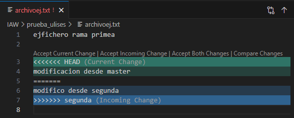

# Título principal

## Subtítulo

Este es un párrafo con **palabras en negrita**, *palabras en cursiva* y `palabras en código`.

    Bloque de codigo.
    Ejemplo;

1. Lista ordenada 1.
2. Lista ordenada 2.
3. Lista ordenada 3.

- Lista desordenada 1.
- Lista desordenada 2.
- Lista desordenada 3.

https://github.com/Uliseesscg3

https://github.com/Uliseesscg3/prueba_ulises/blob/master/ejercicio3.md

| Columna 1 | Columna 2 | Columna 3 |
|-----------|-----------|-----------|
|   Fila 1  |  Fila 1   |  Fila 1   |
|   Fila 2  |  Fila 2   |  Fila 2   |
|   Fila 3  |  Fila 3   |  Fila 3   |

