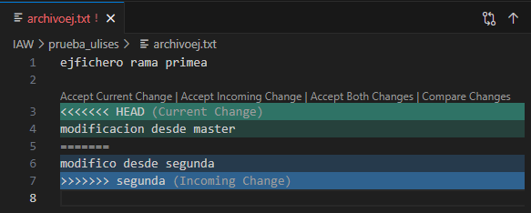

# Ejercicio 3

## Creación de una rama

Para crear una nueva rama tendremos que usar el comando "git branch (nombre_rama)" y para ver las ramas las cuales existen le añadiremos "-v" despues de "git branch"

## Creación y fusion fichero

Creamos un fichero y lo fusionamos con nuestra rama principal, al no haber hecho ninguna modificacion desde la rama principal no se generaría ningun conflicto.

## Eliminación rama

Con el comando "git branch -d (nombre_rama)" eliminariamos la rama seleccionada.

## Creación de un archivo en una rama nueva y generar conflicto

Para crear un conflicto lo primero que haremos será modificar el archivo desde la rama segunda y una vez modificado haremos los pasos necesarios como "git add . y git commit" una vez hecho eso haremos lo mismo con la rama principal y la fusionaremos con la rama segunda.

Una vez hecha la fusion nos quedara el siguiente error.

## Solución del conflicto y sincronizacion en remoto

Para solucionar el conflicto tendremos que eliminar una de las dos modificaciones y en este caso nos quedaremos con la modificacion de la rama principal.

Una vez arreglado el conflicto tendremos que sincronizarlo en remoto aplicando los cambios y ejecutando "git push origin segunda"

Y veremos como aparece en github.

