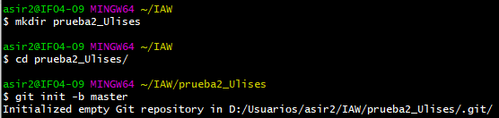
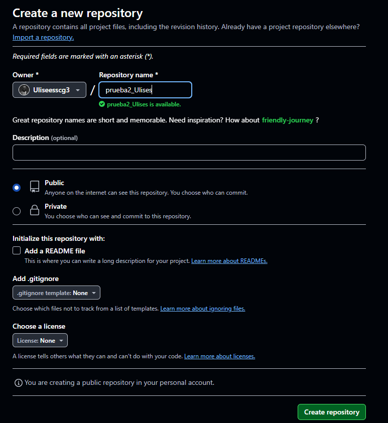
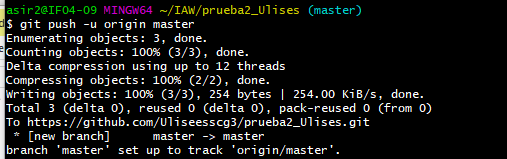
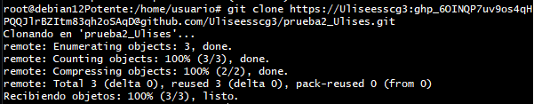
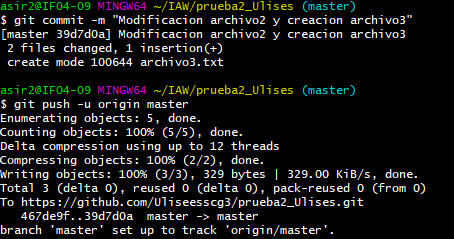
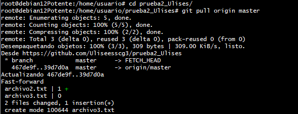

# Ejercicio 1

1. Creacion de directorio y archivos.  
   
     

   En este apartado lo que haremos sera crear un nuevo directorio y lo haremos ser un repositorio con el comando "get init".

   ---

2. Conectar repositorio local con uno remoto en github.

   
   

Aqui crearemos el repositorio en github y una vez creado con  el comando "git remote add origing (url) lo conectaremos"

---

3. Subir el repositorio local a github.

Una vez conectado el repositorio lo subiremos a github con el comando "git push -u origin (rama)"

---

4. Clonar repositorio en una maquina.

Con el comando "git clone (url_repositorio)" lo que haremos será clonar el repositorio el cual tenemos remotamente en github en debian

---

5. Modificación de archivos.
   

Modificaremos los archivos creados anteriormente y con el comanndo "git add" los añadiremos al repositorio despues con el comando "git commit" comentaremos los cambios y una vez echo eso con "git push" se subiran los cambios a github.

---

6. Actualizar version local del repositorio.

Una vez hechos todos los cambios los cuales deseamos hacer con el comando "git pull" actualizaremos el repositorio en nustro servidor para guardar los datos.